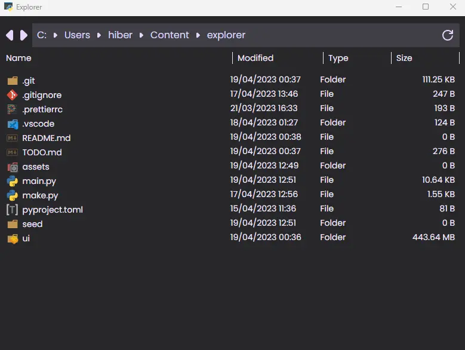

_Icons from [vscode-icons](https://github.com/vscode-icons/vscode-icons)_

It's a file explorer with some features that I think it would be nice for a file explorer to have. Extremely WIP.

## How to run
```
git clone https://github.com/lui-dias/explorer

cd explorer
pip install -r requirements.txt

cd ui
pnpm install

cd ..
python main.py
```

After first run, you can just run `python main.py` to start the server.

If the server doesn't load in time, wait a bit and reload the page.

### [Features/TODO](TODO.md)

## How to seed a folder with files
The command will create the files in the `seed` folder, the folder is created if the folder does not exist

```
python main.py seed <n_files> <size>
```

Example
```
python main.py seed 1000 1b
python main.py seed 100 1kb
python main.py seed 10 10mb
python main.py seed 1 10gb
```
