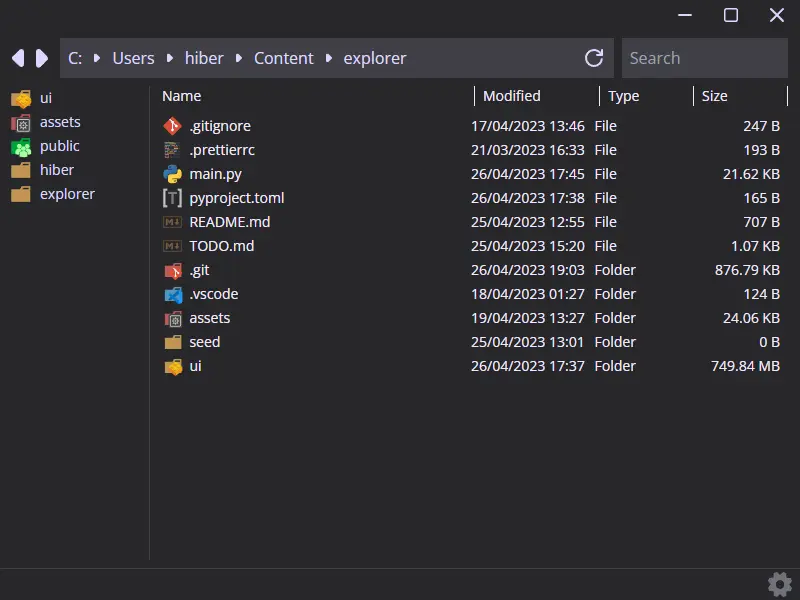

# File explorer written with Svelte and Python

It's a file explorer with some features that I think it would be nice for a file explorer to have. Extremely WIP.

## How to run
```bash
python make.py
```
If the server doesn't load in time, wait a bit and reload the page.

### [Features/TODO](TODO.md)

